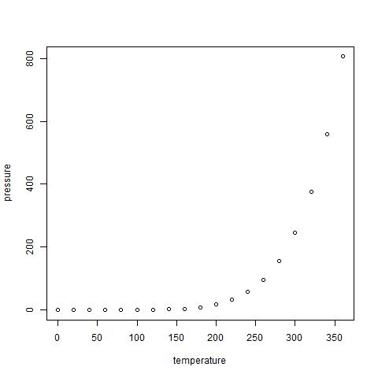

knit: (function(input_file, encoding) {
  out_dir <- 'docs';
  rmarkdown::render(input_file,
 encoding=encoding,
 output_file=file.path(dirname(input_file), out_dir, 'index.html'))})


 
```{r setup, include=FALSE}
knitr::opts_chunk$set(echo = TRUE)
```

## R Markdown

This is an R Markdown document. Markdown is a simple formatting syntax for authoring HTML, PDF, and MS Word documents. For more details on using R Markdown see <http://rmarkdown.rstudio.com>.

When you click the **Knit** button a document will be generated that includes both content as well as the output of any embedded R code chunks within the document. You can embed an R code chunk like this:

Now just the code

```{r cars, eval=FALSE}
summary(cars)
head(cars)
``` 
The mean car speed is 15.4 mph.

##Add links and images 

[Ocean](https://www.nationalgeographic.org/encyclopedia/ocean/) 


## Including Plots

You can also embed plots, for example:

```{r pressure, include=FALSE}
jpeg(file = "pressure.jpeg")
plot(pressure)
dev.off()
```

Note that the `echo = FALSE` parameter was added to the code chunk to prevent printing of the R code that generated the plot.

and now let’s add the figure from a saved file:

```{r pressure plot from a file}
 

```

Other way to add images to the markdown... :) 


